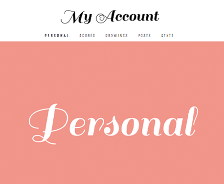

# Crystal Prism
I started programming in January 2017 and am learning HTML, CSS and JavaScript for front-end web development. My website, [Crystal Prism](https://crystalprism.io), is a portfolio of my projects, which range from a moving clock to an educational game to a communal drawing app. Users can create an account through my website to store their game scores, personal drawings, and public and private blog posts. My projects are listed from oldest to newest below.

## Timespace
#### January 2017 - Present

[Timespace](https://crystalprism.io/timespace/) is a clock that depicts the movement of time with circles that change color and location on the page based on the current time. The clock displays a quote from T. S. Eliot and plays the sound of Saturn's rings in the background, meant to elicit peaceful reflection on the conception and passage of time. This is the first web project I developed.

## Shapes in Rain
#### January 2017 - Present

[Shapes in Rain](https://crystalprism.io/shapes-in-rain/) is a game in which random shapes appear periodically on the page for a user to clear with a click. Hearts rain down the screen and light piano music plays in the background to create a peaceful scene for users to clear their minds as they clear the shapes from the page. The rain and shapes clear on their own after a certain time interval to optimize system performance. Users' scores are saved to a server when they close the page if they have a registered account.

## Rhythm of Life
#### February 2017 - Present

[Rhythm of Life](https://crystalprism.io/rhythm-of-life/) is an educational take on the classic game Snake. Users direct a moving heart across a game board to seek blood pressure relievers and avoid stressors that follow the heart to maintain a low blood pressure. As the heart collides with stressors, the blood pressure increases and the heart's and stressors' speed increases. The game ends when the blood pressure has reached hypertensive levels, and the user's lifespan is saved to a leaderboard on a server. The game board displays information about blood pressure stressors and relievers, with links to heart health sources like WebMD and the American Heart Association. I use [Snap.svg](http://snapsvg.io) to ease canvas and object manipulation, as well as [Howler](https://howlerjs.com) to control the background heartbeat sound.

## CanvaShare
#### March 2017 - Present

[CanvaShare](https://crystalprism.io/canvashare/) is a community drawing gallery that lets users create drawings and share them on a public gallery. From the gallery, users can like and view others' drawings and can iterate on a drawing to make it their own. I use [Snap.svg](http://snapsvg.io) for canvas and object manipulation, as well as [EaselJS](https://www.createjs.com/easeljs) for canvas drawing functions. If users have a registered account, their drawings are saved to their public profile page for others to see and like. Drawing lets me express myself in a way that words often cannot, so I created this project to allow others to do the same, sharing and gleaning inspiration from the community.

## Thought Writer
#### August 2017 - Present

[Thought Writer](https://crystalprism.io/thought-writer/) is a community post board for users to post short ideas for others to read and comment on. Posts are created through a What-You-See-Is-What-You-Get (WYSIWYG) text editor that allows users to save their posts to the public board and/or save their own private posts if they have a registered account. I originally created this text editor as a personal diary for the Ideas page, to document thoughts on programming, design, and life in general, then decided to make it communal as a public board for users to tack up ideas on. The name derives from a combination of "thought book" (an old diary of mine) and "typewriter."

## Vicarious
#### August 2017 - Present

[Vicarious](https://crystalprism.io/vicarious/) is a travel photo hub that allows users to search for a place they want to visit and pull up the latest images of that place that are posted on [Reddit's Travel subreddit](https://www.reddit.com/r/travel/). I used Bootstrap to design the layout of the project and fetch to request post and image data from Reddit's API. I often daydream about traveling and like to look through pictures for inspiration for future trips (even if I don't end up taking those trips), so I created this project to facilitate my vicarious habits.

## User Accounts
#### September 2017 - Present

Users who want to join the Crystal Prism community can create an account to store their Shapes in Rain and Rhythm of Life scores, their CanvaShare drawings, and their Thought Writer posts. Each user has a personal profile that others can visit to see the work the user has created on the website. Users can also update their personal information and view member statistics (e.g., number of drawings created) on the My Account page. I used Bootstrap to stylize each page of the user account experience ([Create Account page](https://crystalprism.io/user/create-account/), [Sign In page](https://crystalprism.io/user/sign-in/), [My Account page](https://crystalprism.io/user/my-account/), and [Profile page](https://crystalprism.io/user/?username=user)). I used the Google font *Sail* for titles on the user account pages to create a bold, luxurious look to match the diamond logo that each user can change the color of for their profile. I aimed to make the My Account page minimal and clean by only revealing content when users click the desired content menu (e.g., Scores, Posts, Drawings).

## Thank You
I am incredibly grateful to my teacher, [Ankur Saxena](https://github.com/as3445). His knowledge, creativity and patience has given me the confidence and inspiration to learn programming and create these projects.

I am also grateful to [BrowserStack](https://www.browserstack.com) for letting me use their service free of charge to test my website across browsers and devices. BrowserStack allowed me to get an accurate handle on cross-browser and cross-device compatible code, teaching me many useful browser/device considerations along the way.

PNG and SVG icons/logos on my website were created by icon websites such as [Font Awesome](http://fontawesome.io/), [Icons8](https://icons8.com/), [Fontello](http://fontello.com/) and [Wikimedia Commons](https://commons.wikimedia.org/wiki/Main_Page), or were found on company websites (e.g., [Apache](https://www.apache.org/foundation/press/kit/)).
