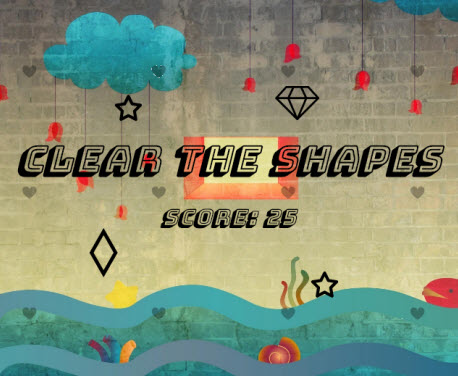
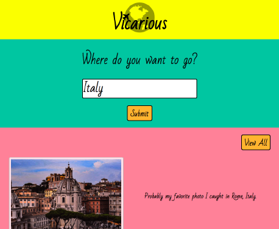

# Crystal Prism
I started programming in January 2017. I am learning HTML, CSS, JavaScript and Python. My website, [Crystal Prism](http://crystalprism.io), is a portfolio of each of my projects. I aim to incorporate responsive design, movement, color and shapes to explore functional aesthetics in my projects.

## Timespace

[Timespace](http://crystalprism.io/timespace/index.html) is my first coding project. It takes numbers a step further to depict time, using them to generate movement and color to trace time's passage each second. I use JavaScript to select three digits of the current time string as the x coordinate of the circle and a different set of three digits as the y coordinate. Each circle color is a different set of six digits of the time string, converted to hexadecimal.

## Shapes in Rain

[Shapes in Rain](http://crystalprism.io/shapes-in-rain/index.html) incorporates randomized SVG placement to generate a peaceful scene where the user can clear shapes as they clear their mind. I use JavaScript to generate a random shape from a set of SVGs and give that shape random coordinates. When the user clicks one of the shapes, the shape gets "blasted" out of the scene, clearing the space for the heart rain that continues to fall in the background, generated from SVG cloning. The rain and shapes will clear on their own after a certain time interval to minimize system performance.

## Rhythm of Life

[Rhythm of Life](http://crystalprism.io/rhythm-of-life/index.html) is an educational take on the classic game *Snake*. The game allows you to move a heart across an SVG canvas to seek relievers and avoid stressors to maintain a low blood pressure. As you collide with stressors, your blood pressure increases, and the game speeds up. The game board displays information about blood pressure stressors and relievers, with links to more details on websites like WebMD and the American Heart Association. The game is designed in this way because stressors will constantly arise, but you must seek out relievers to maintain good health. Once you exceed the blood pressure range for stage 2 hypertension, the game ends, and you can record your name and lifespan in the leaderboard. I use [Snap](http://snapsvg.io) to ease canvas and object manipulation, as well as [Howler](https://howlerjs.com) to control the background heartbeat sound. I also use Python flask server code to store and retrieve each player's lifespan and display the top 5 leaders on the game board.

## CanvaShare

[CanvaShare](http://crystalprism.io/canvashare/index.html) is an interactive drawing program that lets you create drawings in a predefined square shape, using a series of palettes. After you create your drawing, you can give it a title and post it to the gallery and/or download a copy. The gallery displays everyone's images, and when you click one of the images, it becomes your starting canvas so you can add on to it and create a new drawing of your own. The gallery also displays the view count for each image based on the number of times it has been clicked. I use [Snap](http://snapsvg.io) for canvas and object manipulation, as well as [EaselJS](http://www.createjs.com/easeljs) for canvas drawing. CanvaShare is my first project that involves sending data to a backend using JavaScript's fetch method and Python flask server code.

## Thought Writer

[Thought Writer](http://crystalprism.io/thought-writer/index.html) is a What-You-See-Is-What-You-Get (WYSIWYG) text editor that allows you to save and retrieve your posts to and from a server. I created this text editor as a personal diary for my website's Ideas page, to document thoughts on programming, design, and life in general. The name derives from a combination of "thought book" (an old diary I used to keep) and "typewriter". The text editor allows you to add images and links to your posts, as well as a title and various formatting options via JavaScript's `execCommand` function and HTML data attributes. The editor also automatically saves your work during your browser session, in case you want to return to your post at a later time. I use Python flask server code to store and retrieve the posts, complete with their formatting, links and images.

## Vicarious

[Vicarious](http://crystalprism.io/vicarious/index.html) is a travel photo hub that allows users to search for a place they want to visit and pull up the latest images posted on [Reddit's Travel subreddit](https://www.reddit.com/r/travel/). I used Bootstrap to design the layout of the project and make it responsive to different device sizes, as well as implement a modal and carousel. The project sends a fetch request to Reddit's API and stores all resulting images in an array, then displays up to 5 of those images that have titles containing the user's desired destination. When a user clicked on the title link for the project, 5 random images will display for inspiration.

## Thank You
I am incredibly grateful to my teacher, [Ankur Saxena](https://github.com/as3445). His knowledge, creativity and patience has given me the confidence and inspiration to make these coding projects my own.

I would also like to thank [BrowserStack](https://www.browserstack.com) for letting me use their service free of charge to test my website across browsers and devices. BrowserStack allowed me to get an accurate handle on cross-browser and cross-device compatible code, teaching me many useful browser/device quirks along the way!
